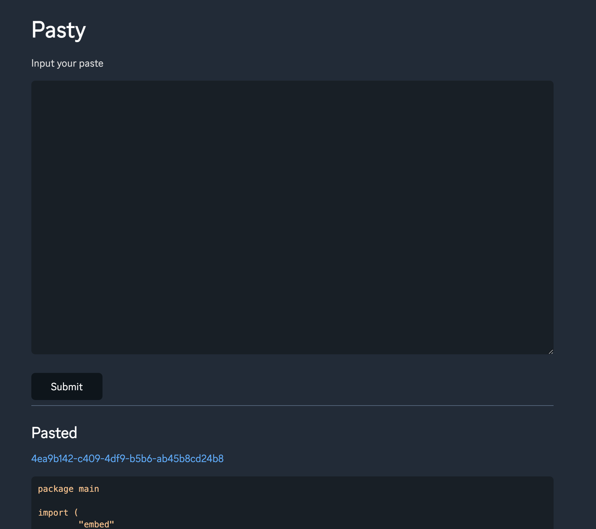
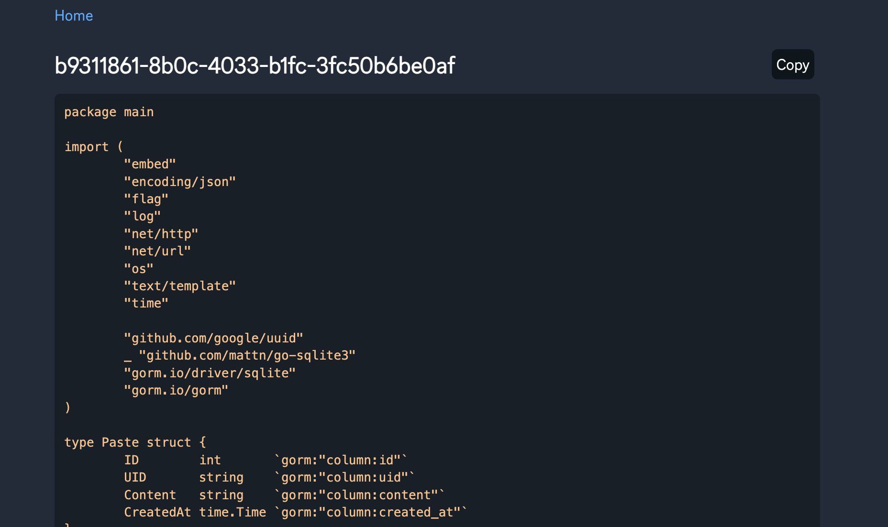

# Pasty

`Pasty` is a very beautiful `Pastebin` alternative.

You can view more information at my blog [Pasty - Beautiful pastebin website with Go, Turnstile, OAuth](https://abcdlsj.github.io/posts/pasty-go-pastebin-like-website.html)

## Features
- Beautiful theme and auto dark mode based on system (`water.css`)
- Cloudflare Turnstile
- GitHub OAuth

## Images

Index page

Cloudflare Turnstile

Paste item page

GitHub OAuth
